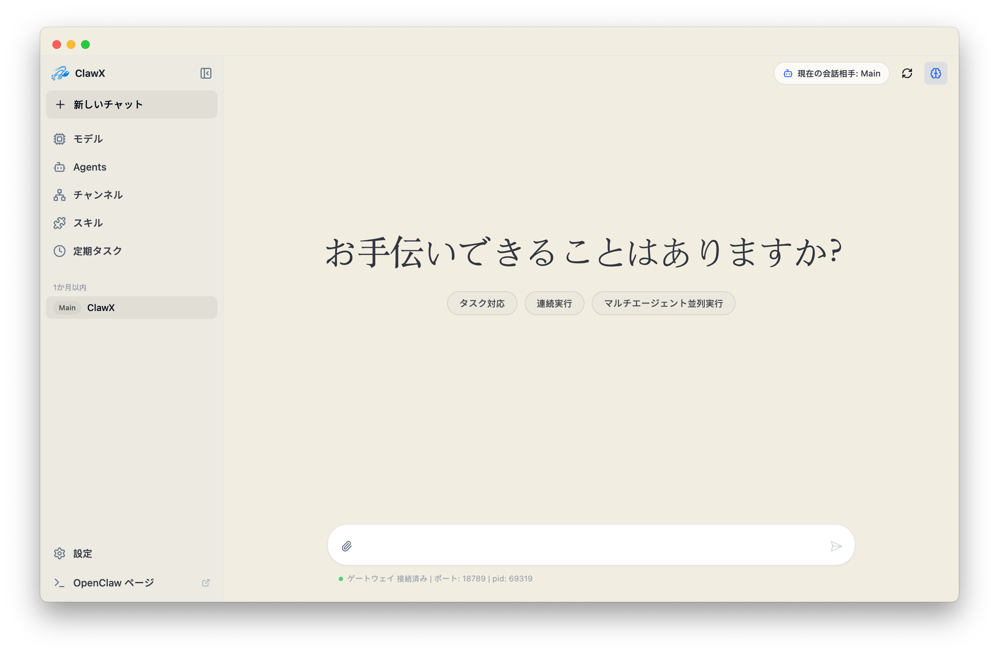
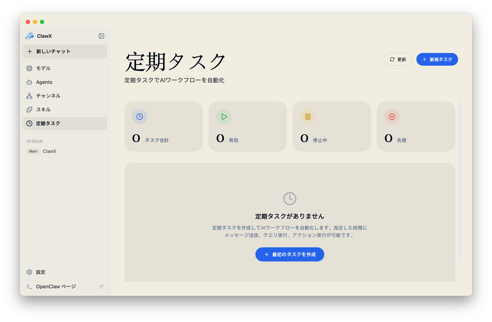
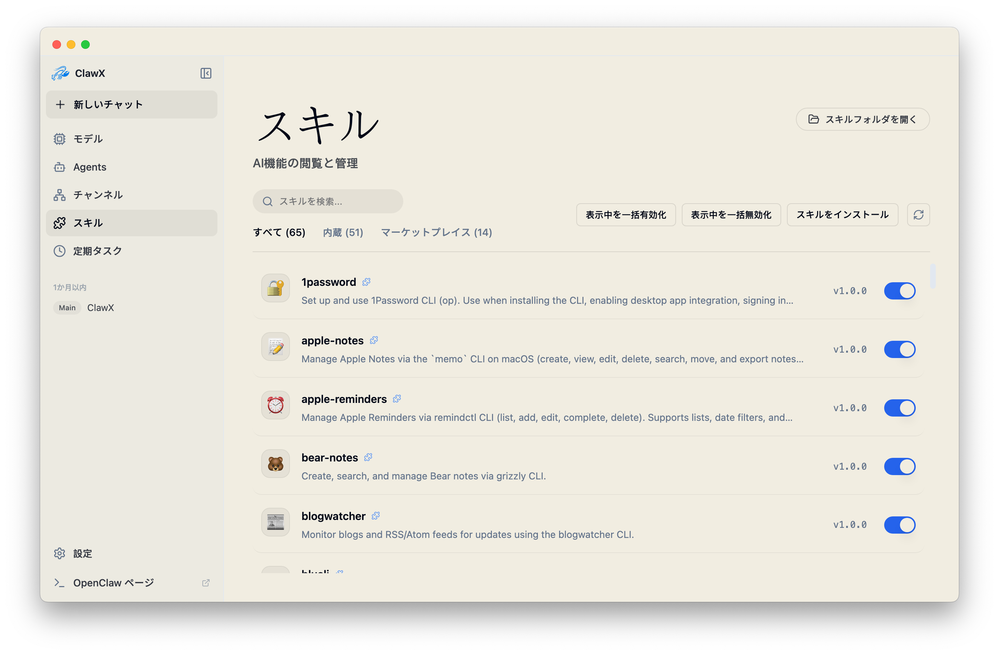
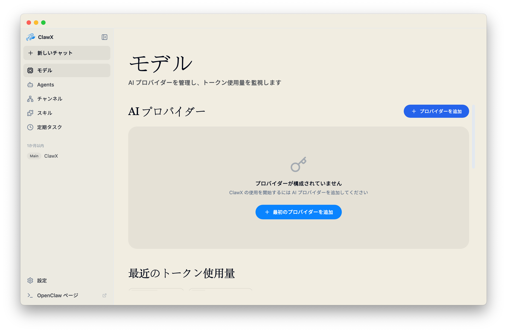
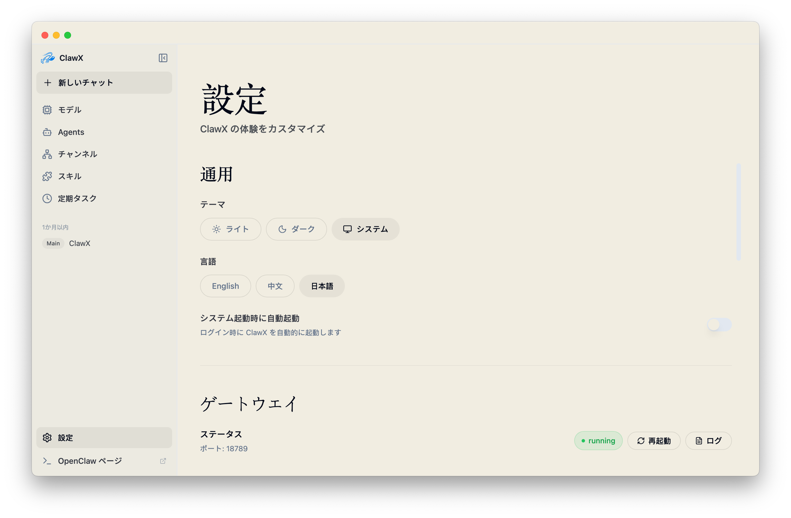

<p align="center">
  
</p>

<h1 align="center">极智</h1>

<p align="center">
  <strong>OpenClaw AIエージェントのためのデスクトップインターフェース</strong>
</p>

<p align="center">
  <a href="#機能">機能</a> •
  <a href="#なぜmimiclawなのか">なぜ极智なのか</a> •
  <a href="#はじめに">はじめに</a> •
  <a href="#アーキテクチャ">アーキテクチャ</a> •
  <a href="#開発">開発</a> •
  <a href="#コントリビューション">コントリビューション</a> •
  <a href="#コントリビューター">コントリビューター</a>
</p>

<p align="center">
  
  
  
  <a href="https://discord.com/invite/84Kex3GGAh" target="_blank">
  
  </a>
  
  
</p>

<p align="center">
  <a href="README.md">English</a> | <a href="README.zh-CN.md">简体中文</a> | 日本語
</p>

---

## 概要

**极智**は、強力なAIエージェントと日常のユーザーとの間のギャップを埋めます。[OpenClaw](https://github.com/OpenClaw)をベースに構築されており、コマンドラインによるAIオーケストレーションを、アクセスしやすく美しいデスクトップ体験に変換します。ターミナルは不要です。

ワークフローの自動化、AI搭載チャネルの管理、インテリジェントなタスクのスケジューリングなど、极智はAIエージェントを効果的に活用するために必要なインターフェースを提供します。

极智はベストプラクティスのモデルプロバイダーが事前設定されており、Windowsおよび多言語設定をネイティブにサポートしています。もちろん、**設定 → 詳細設定 → 開発者モード**から高度な設定を微調整することもできます。

---
## スクリーンショット

<p align="center">
  
</p>

<p align="center">
  
</p>

<p align="center">
  
</p>

<p align="center">
  
</p>

<p align="center">
  
</p>

---

## なぜ极智なのか

AIエージェントの構築にコマンドラインの習得は不要であるべきです。极智はシンプルな哲学のもとに設計されました：**強力な技術には、あなたの時間を尊重するインターフェースがふさわしい。**

| 課題 | 极智のソリューション |
|------|----------------------|
| 複雑なCLIセットアップ | ワンクリックインストールとガイド付きセットアップウィザード |
| 設定ファイル | リアルタイムバリデーション付きのビジュアル設定 |
| プロセス管理 | ゲートウェイライフサイクルの自動管理 |
| 複数のAIプロバイダー | 統合プロバイダー設定パネル |
| スキル/プラグインのインストール | 組み込みのスキルマーケットプレイスと管理機能 |

### OpenClaw内蔵

极智は公式の**OpenClaw**コアを直接ベースに構築されています。別途インストールを必要とせず、アプリケーション内にランタイムを組み込むことで、シームレスな「バッテリー同梱」体験を提供します。

私たちはアップストリームのOpenClawプロジェクトとの厳密な整合性を維持することにコミットしており、公式リリースが提供する最新の機能、安定性の改善、エコシステムの互換性に常にアクセスできることを保証します。

---

## 機能

### 🎯 ゼロ設定バリア
インストールから最初のAIインタラクションまで、すべてのセットアップを直感的なグラフィカルインターフェースで完了できます。ターミナルコマンド不要、YAMLファイル不要、環境変数の探索も不要です。

### 💬 インテリジェントチャットインターフェース
モダンなチャット体験を通じてAIエージェントとコミュニケーションできます。複数の会話コンテキスト、メッセージ履歴、Markdownによるリッチコンテンツレンダリング、マルチエージェント構成での `@agent` 直接ルーティングに加え、チャット入力欄からワンクリックでスクリーンショットを添付できます。
メインウィンドウのサイドバーは固定3分類（スレッド / OpenClaw / リアルタイム音声）で会話を整理し、スレッドはワークスペースごとに会話（タイトル + 相対時刻）を表示します。タイトルバーのツールチップ付きボタンまたは `Cmd/Ctrl + B` で表示を切り替えできます。
`@agent` で別のエージェントを選ぶと、极智 はデフォルトエージェントを経由せず、そのエージェント自身の会話コンテキストへ直接切り替えます。各エージェントのワークスペースは既定で分離されていますが、より強い実行時分離は OpenClaw の sandbox 設定に依存します。
フローティングペットの音声入力は、マイク音声を Volcengine のリアルタイム ASR にストリーミングし、途中経過の文字起こしを表示しながら、録音終了後に認識テキストを Mini Chat へ直接送ります。利用前に **設定 → 音声とペット → Volcengine ASR** で `App ID`、`Cluster`、`Access Token` を設定してください。
さらに、フローティングペットの右クリックメニューから専用の **音声会話** ウィンドウを開き、Volcengine のリアルタイム音声機能で全二重の常時マイク会話を行えるようになりました。安定した発話は読み取り専用の `Voice Chat` 履歴へ同期されます。利用前に **設定 → 音声とペット → 音声会話** で `APP ID` と `Access Token` を設定してください。Volcengine ASR を設定済みなら、既存の `Access Token` をそのまま再利用できます。
同じ右クリックメニューには **コードアシスタント** も追加され、Mini Chat をワークスペース主導のスレッドモードで直接開けます。手動で通常チャットへ戻すかミニウィンドウを閉じるまで、その後のメッセージも Claude Code ワークフローに送り続けます。
Mini Chat / スレッド会話のヘッダーは、実行中タスクがある間は現在の Agent / スレッドを動的インジケーター付きで表示します。スレッド画面の右上では、ボタンまたは `Cmd/Ctrl + J` で下部ターミナルパネルを切り替えられ、コマンド入力とシェルセッションの継続利用が可能です。
macOS のメニューバーでは、トレイアイコンが円環 + パーセンテージでセッション稼働圧力を表示します（0-100%、1 秒更新、滑らかに遷移。Gateway エラー時は `ERR`）。
左/右クリックはいずれもネイティブメニューを開き、メニュー上部には「セッション稼働圧力 + Gateway 状態」を表示します。先頭項目は最新アクティブセッションへ移動（無ければメインウィンドウへ戻る）。実行中セッションは最大 5 件まで表示し、超過分は「あと N 件...」として案内します。
トレイ操作には状態ガバナンスとスマート抑制も入り、メニュー/パネルは相互排他、短時間の重複クリックはデデュープされます。プログラム起因の注意喚起は、メインウィンドウやターミナルが前面のとき自動抑制されます。
同じ右クリックメニューには **属性パネル** も追加され、ミニポップアップで Claude Code の companion system を参考にしたレア度、装備、5 つの成長型能力値をローカル保存して表示できます。能力値は `0` から始まり、ミニチャット、音声対話、コードアシスタントの利用に応じて少しずつ伸び、あわせてレベル、段階、親密度、突破マイルストーン、行動別経験値も追跡されます。
設定画面では、音声会話 / ASR / Gateway の主要設定を、口令入力付きの画面内フローでローカル暗号化ファイル（フォールバック設定バンドル）としてエクスポートできます。さらに配布ビルドでは `default-fallback-profile.json` を `resources/fallback/` に配置して同梱すると、初回セットアップ時にパスワードを入力するだけで自動事前入力できます。

### 📡 プラグイン管理
OpenClaw プラグインをデスクトップからまとめて確認できます。現状の Plugins ページは、プラグインのインストールと MCP 対応プラグインの確認に絞っています。
同梱プラグインやローカルで検出されたプラグインを一覧表示し、インストール済みディレクトリを直接開けます。
Feishu / WeCom など MCP 能力を持つプラグインは専用セクションでまとめて確認できます。

### ⏰ Cronベースの自動化
AIタスクを自動的に実行するようスケジュール設定できます。トリガーを定義し、間隔を設定することで、手動介入なしにAIエージェントを24時間稼働させることができます。

### 🖥️ ローカル実行センター
デスクトップネイティブなローカル skill を MimiClaw 内で直接実行できます。現在の MVP にはディレクトリレポート、バッチリネームのプレビュー、Downloads 整理、ローカルコマンド実行が含まれ、デスクトップクライアントを単なるチャット UI ではなく実行ノードへ拡張します。
同梱ローカル skill パッケージは `resources/skills/local` から自動検出され、ユーザー定義のローカル skill パッケージは `~/.mimiclaw/skills/local` に追加できます。最近の実行記録はローカルに永続化され、監査や再確認に利用できます。

### 🧩 拡張可能なスキルシステム
事前構築されたスキルでAIエージェントを拡張できます。統合スキルパネルからスキルの閲覧、インストール、管理が可能です。パッケージマネージャーは不要です。
极智 はドキュメント処理スキル（`pdf`、`xlsx`、`docx`、`pptx`）もフル内容で同梱し、起動時に管理スキルディレクトリ（既定 `~/.openclaw/skills`）へ自動配備し、初回インストール時に既定で有効化します。追加の同梱スキル（`find-skills`、`self-improving-agent`、`tavily-search`、`brave-web-search`）も既定で有効化されますが、必要な API キーが未設定の場合は OpenClaw が実行時に設定エラーを表示します。  
Skills ページでは OpenClaw の複数ソース（管理ディレクトリ、workspace、追加スキルディレクトリ）から検出されたスキルを表示でき、各スキルの実際のパスを確認して実フォルダを直接開けます。スキルストアは `npx skills`（skills.sh）で検索・インストールし、初回利用時に Node ランタイムを `~/.mimiclaw/runtime/node` に自動準備できます。

主な検索スキルで必要な環境変数:
- `BRAVE_SEARCH_API_KEY`: `brave-web-search` 用
- `TAVILY_API_KEY`: `tavily-search` 用（上流ランタイムで OAuth 対応の場合あり）

### 🔐 セキュアなプロバイダー統合
複数のAIプロバイダー（OpenAI、Anthropicなど）に接続でき、資格情報はシステムのネイティブキーチェーンに安全に保存されます。OpenAI は API キーとブラウザ OAuth（Codex サブスクリプション）の両方に対応しています。

### 🌙 アダプティブテーマ
ライトモード、ダークモード、またはシステム同期テーマ。极智はあなたの好みに自動的に適応します。

### 🚀 自動起動設定
**設定 → 外観** から **システム起動時に自動起動** を有効化すると、ログイン後に 极智 が自動的に起動します。

---

## はじめに

### システム要件

- **オペレーティングシステム**: macOS 11以上、Windows 10以上、またはLinux（Ubuntu 20.04以上）
- **メモリ**: 最低4GB RAM（8GB推奨）
- **ストレージ**: 1GBの空きディスク容量

### インストール

#### ビルド済みリリース（推奨）

[Releases](https://github.com/Emma-Alpha/MimiClaw/releases)ページから、お使いのプラットフォーム向けの最新リリースをダウンロードしてください。

macOS では、リリースに含まれる `app.asar` ペイロードをダウンロードして再起動することで、段階的なアプリ内更新を適用できます。バンドル済みバイナリや追加リソースも変更されるリリースでは、完全な `.dmg` / `.zip` パッケージをインストールしてください。

#### ソースからビルド

```bash
# リポジトリをクローン
git clone https://github.com/Emma-Alpha/MimiClaw.git
cd MimiClaw

# プロジェクトの初期化
pnpm run init

# 開発モードで起動
pnpm dev
```

環境ファイルの運用ルール:

- ローカル開発は `.env.development`
- テスト / ステージング用ビルドは `.env.test` と `vite build --mode test`
- リリース用ビルドは `.env.production`
- `*.local` は各端末専用の上書き用で、通常はコミットしません

リリース時にバージョンの上げ幅を対話的に選びたい場合は、次のスクリプトを使えます。

```bash
pnpm run version:select
```

changesets のように `patch / minor / major` を選択でき、既存のバージョン更新フローをそのまま利用します。

### 初回起動

极智を初めて起動すると、**セットアップウィザード**が以下の手順をガイドします：

1. **ウェルカム** – 表示言語を選び、最短のセットアップ経路を確認
2. **ランタイム** – ローカル実行環境またはクラウドワークスペースの準備状況を確認
3. **AIプロバイダー** – APIキーまたは OAuth でデフォルトのモデルを1つ接続
4. **バックグラウンド準備** – 残りの初期化は 极智 が自動で完了

サポート対象のシステム言語がある場合、ウィザードはその言語を初期選択し、未対応の場合は英語にフォールバックします。
Volcengine ASR、音声会話、メッセージングチャンネル、開発者向けの高度な設定は初回起動を妨げず、アプリに入った後で **設定** から追加できます。

### プロキシ設定

极智には、Electron、OpenClaw Gateway、またはTelegramなどのチャネルがローカルプロキシクライアントを介してインターネットにアクセスする必要がある環境向けに、組み込みのプロキシ設定が含まれています。

**設定 → ゲートウェイ → プロキシ**を開いて以下を設定します：

- **プロキシサーバー**: すべてのリクエストのデフォルトプロキシ
- **バイパスルール**: 直接接続すべきホスト（セミコロン、カンマ、または改行で区切る）
- **開発者モード**では、オプションで以下をオーバーライドできます：
  - **HTTP プロキシ**
  - **HTTPS プロキシ**
  - **ALL_PROXY / SOCKS**

推奨されるローカル設定例：

```text
プロキシサーバー: http://127.0.0.1:7890
```
注意事項：

- `host:port`のみの値はHTTPとして扱われます。
- 高度なプロキシフィールドが空の場合、极智は`プロキシサーバー`にフォールバックします。
- プロキシ設定を保存すると、Electronのネットワーク設定が即座に再適用され、ゲートウェイが自動的に再起動されます。
- 极智はTelegramが有効な場合、プロキシをOpenClawのTelegramチャネル設定にも同期します。
- 极智のプロキシが無効な状態では、Gatewayの通常再起動時に既存のTelegramチャネルプロキシ設定を保持します。
- OpenClaw設定のTelegramプロキシを明示的に消したい場合は、プロキシ無効の状態で一度「保存」を実行してください。
- **設定 → 詳細 → 開発者** では **OpenClaw Doctor** を実行でき、`openclaw doctor --json` の診断出力をアプリ内で確認できます。
- **設定 → 詳細 → 開発者** では、実験的な **Claude Code Agent** sidecar の状態確認に加え、ローカル `claude` CLI のパス・モデル・認証を設定し、ワークスペース実行を手動で開始できます。モデル、Base URL、API キーを空欄にした場合、MimiClaw はまず `~/.claude/settings.json` を参照し、その後で利用可能なら現在のデフォルト Anthropic 互換 Provider を継承します。vendored `Emma-Alpha/claude-code` スナップショットは参照・デバッグ用として保持されますが、実際の実行は Claude CLI 経由です。
- Windows のパッケージ版では、同梱された `openclaw` CLI/TUI は端末入力を安定させるため、同梱の `node.exe` エントリーポイント経由で実行されます。

---

## アーキテクチャ

极智は2種類の実行モードをサポートしています：

- **ローカルモード**（デフォルト）：Electron アプリがローカルで OpenClaw Gateway プロセスを起動し（ポート 18789）、直接接続します。
- **クラウドモード**（オプション）：Electron アプリがクラウドコントロールプレーン（`backend/`）で認証し、クラウドがユーザーごとに独立した OpenClaw Gateway インスタンスを管理します。Electron アプリはシンクライアントとなり、すべての設定変更（プロバイダー・チャンネル・スキル）はクラウド API 経由で行われます。

### クラウドモードのセットアップ

1. クラウドバックエンドを起動（`backend/README.md` 参照）：
   ```bash
   cd backend && npm run dev
   ```
2. 実行中の極智アプリで DevTools を開き、実行：
   ```js
   localStorage.setItem('mimiclaw:cloud-api-base', 'http://localhost:3000')
   location.reload()
   ```
3. `admin / admin` でログイン。アプリはクラウドセッションをメインプロセスに保存し、以降の設定変更はクラウド API 経由でルーティングされます。
4. **設定 → ゲートウェイ** でリモートゲートウェイ WebSocket アドレスを設定できます。

---

极智は、**デュアルプロセス + Host API 統一アクセス**構成を採用しています。Renderer は単一クライアント抽象を呼び出し、プロトコル選択とライフサイクルは Main が管理します：

```┌─────────────────────────────────────────────────────────────────┐
│                        极智 デスクトップアプリ                    │
│                                                                  │
│  ┌────────────────────────────────────────────────────────────┐  │
│  │              Electron メインプロセス                         │  │
│  │  • ウィンドウ＆アプリケーションライフサイクル管理              │  │
│  │  • ゲートウェイプロセスの監視                                │  │
│  │  • システム統合（トレイ、通知、キーチェーン）                 │  │
│  │  • 自動アップデートオーケストレーション                       │  │
│  └────────────────────────────────────────────────────────────┘  │
│                              │                                    │
│                              │ IPC（権威ある制御プレーン）            │
│                              ▼                                    │
│  ┌────────────────────────────────────────────────────────────┐  │
│  │              React レンダラープロセス                        │  │
│  │  • モダンなコンポーネントベースUI（React 19）                │  │
│  │  • Zustandによるステート管理                                 │  │
│  │  • 統一 host-api/api-client 呼び出し                          │  │
│  │  • リッチなMarkdownレンダリング                              │  │
│  └────────────────────────────────────────────────────────────┘  │
└──────────────────────────────┬──────────────────────────────────┘
                               │
                               │ Main管理のトランスポート戦略
                               │（WS優先、HTTP次点、IPCフォールバック）
                               ▼
┌─────────────────────────────────────────────────────────────────┐
│                Host API と Main プロキシ層                       │
│                                                                  │
│  • hostapi:fetch（Mainプロキシ、CORS回避）                       │
│  • gateway:httpProxy（RendererはGateway HTTPに直アクセスしない） │
│  • 統一エラーマッピングとリトライ/バックオフ                     │
└──────────────────────────────┬──────────────────────────────────┘
                               │
                               │ WS / HTTP / IPC フォールバック
                               ▼
┌─────────────────────────────────────────────────────────────────┐
│                     OpenClaw ゲートウェイ                         │
│                                                                  │
│  • AIエージェントランタイムとオーケストレーション                  │
│  • メッセージチャネル管理                                         │
│  • スキル/プラグイン実行環境                                      │
│  • プロバイダー抽象化レイヤー                                     │
└─────────────────────────────────────────────────────────────────┘
```
### 設計原則

- **プロセス分離**: AIランタイムは別プロセスで動作し、重い計算処理中でもUIの応答性を確保します
- **フロントエンド呼び出しの単一入口**: Renderer は host-api/api-client を通じて呼び出し、下位プロトコルに依存しません
- **Mainによるトランスポート制御**: WS/HTTP の選択と IPC フォールバックを Main で一元管理します
- **グレースフルリカバリ**: 再接続・タイムアウト・バックオフで一時的障害を自動処理します
- **セキュアストレージ**: APIキーや機密データは、OSのネイティブセキュアストレージ機構を活用します
- **CORSセーフ設計**: ローカルHTTPはMainプロキシ経由とし、Renderer側CORS問題を回避します

### プロセスモデルと Gateway トラブルシューティング

- 极智 は Electron アプリのため、**1つのアプリインスタンスでも複数プロセス（main/renderer/zygote/utility）が表示される**のが正常です。
- 単一起動保護は Electron のロックに加え、ローカルのプロセスロックファイルも併用し、デスクトップ IPC / セッションバスが不安定な環境でも重複起動を防ぎます。
- ローリングアップグレード中に旧版/新版が混在すると、単一起動保護の挙動が非対称になる場合があります。安定運用のため、デスクトップクライアントは可能な限り同一バージョンへ揃えてください。
- ただし OpenClaw Gateway の待受は常に**単一**であるべきです。`127.0.0.1:18789` を Listen しているプロセスは1つだけです。
- Listen プロセスの確認例:
  - macOS/Linux: `lsof -nP -iTCP:18789 -sTCP:LISTEN`
  - Windows (PowerShell): `Get-NetTCPConnection -LocalPort 18789 -State Listen`
- ウィンドウの閉じるボタン（`X`）は既定でトレイへ最小化する動作で、完全終了ではありません。完全終了する場合はトレイメニューの **Quit 极智** を使用してください。

---

## ユースケース

### 🤖 パーソナルAIアシスタント
質問への回答、メールの下書き、ドキュメントの要約、日常タスクのサポートなど、汎用的なAIエージェントを設定できます。すべてクリーンなデスクトップインターフェースから操作できます。

### 📊 自動モニタリング
ニュースフィード、価格追跡、特定イベントの監視などを行うスケジュールエージェントを設定できます。結果はお好みの通知チャネルに配信されます。

### 💻 開発者の生産性向上
AI を開発ワークフローに統合できます。エージェントを使用して、コードレビュー、ドキュメント生成、反復的なコーディングタスクの自動化が可能です。

### 🔄 ワークフロー自動化
複数のスキルを連鎖させて、高度な自動化パイプラインを作成できます。データの処理、コンテンツの変換、アクションのトリガーを、すべてビジュアルにオーケストレーションできます。

---

## 開発

### 前提条件

- **Node.js**: 22以上（LTS推奨）
- **パッケージマネージャー**: pnpm 9以上（推奨）またはnpm

### プロジェクト構成

```text
MimiClaw/
├── electron/                 # Electron メインプロセス
│   ├── api/                 # メイン側 API ルーターとハンドラー
│   │   └── routes/          # RPC/HTTP プロキシのルートモジュール
│   ├── services/            # Provider/Secrets/ランタイムサービス
│   │   ├── providers/       # provider/account モデル同期ロジック
│   │   └── secrets/         # OS キーチェーンと秘密情報管理
│   ├── shared/              # 共通 Provider スキーマ/定数
│   │   └── providers/
│   ├── main/                # アプリ入口、ウィンドウ、IPC 登録
│   ├── gateway/             # OpenClaw ゲートウェイプロセスマネージャー
│   ├── preload/             # セキュア IPC ブリッジ
│   └── utils/               # ユーティリティ（ストレージ、認証、パス）
├── src/                      # React レンダラープロセス
│   ├── lib/                 # フロントエンド統一 API とエラーモデル
│   ├── stores/              # Zustand ストア（settings/chat/gateway）
│   ├── components/          # 再利用可能な UI コンポーネント
│   ├── pages/               # Setup/Dashboard/Chat/Plugins/Skills/Cron/Settings
│   ├── i18n/                # ローカライズリソース
│   └── types/               # TypeScript 型定義
├── tests/
│   └── unit/                # Vitest ユニット/統合寄りテスト
├── resources/                # 静的アセット（アイコン、画像）
└── scripts/                  # ビルド/ユーティリティスクリプト
```
### 利用可能なコマンド

```bash
# 開発
pnpm run init             # 依存関係のインストール + uvのダウンロード
pnpm dev                  # ホットリロードで起動（不足時は同梱スキルを自動準備）

# コード品質
pnpm lint                 # ESLintを実行
pnpm run lint:check       # 自動修正なしで ESLint を実行（CI 用）
pnpm typecheck            # TypeScriptの型チェック

# テスト
pnpm test                 # ユニットテストを実行
pnpm run test:ci          # CI 向けの静かなユニットテストを実行
pnpm run comms:replay     # 通信リプレイ指標を算出
pnpm run comms:baseline   # 通信ベースラインを更新
pnpm run comms:compare    # リプレイ指標をベースライン閾値と比較

# ビルド＆パッケージ
pnpm run build:vite       # フロントエンドのみビルド
pnpm run build:vite:test  # .env.test で renderer/main/preload をビルド
pnpm run build:vite:prod  # .env.production で renderer/main/preload をビルド
pnpm build                # フルプロダクションビルド（パッケージアセット含む）
pnpm package              # 現在のプラットフォーム向けにパッケージ化（同梱プリインストールスキルを含む）
pnpm run package:test     # .env.test でパッケージ用アセットをビルド
pnpm run package:prod     # .env.production でパッケージ用アセットをビルド
pnpm package:mac          # macOS向けにパッケージ化
pnpm run package:mac:test # .env.test で macOS 向けにパッケージ化
pnpm run package:mac:prod # .env.production で macOS 向けにパッケージ化
pnpm run package:mac:cloud:prod # OpenClaw を同梱しない cloud-only macOS パッケージ
pnpm package:win          # Windows向けにパッケージ化
pnpm run package:win:test # .env.test で Windows 向けにパッケージ化
pnpm run package:win:prod # .env.production で Windows 向けにパッケージ化
pnpm run package:win:cloud:prod # OpenClaw を同梱しない cloud-only Windows パッケージ
pnpm package:linux        # Linux向けにパッケージ化
pnpm run package:linux:test # .env.test で Linux 向けにパッケージ化
pnpm run package:linux:prod # .env.production で Linux 向けにパッケージ化
pnpm run package:linux:cloud:prod # OpenClaw を同梱しない cloud-only Linux パッケージ
```

### 環境別パッケージング

- `pnpm package`、`pnpm package:mac`、`pnpm package:win`、`pnpm package:linux` は従来どおり Vite の `production` モードでビルドします。
- テスト環境向けのパッケージは `pnpm run package:test` または各プラットフォームの `*:test` スクリプトを使ってください。これらは [.env.test](/Users/liangpingbo/Desktop/4399/electron/MimiClaw/.env.test) を読みます。
- 本番環境向けのパッケージは `pnpm run package:prod` または各プラットフォームの `*:prod` スクリプトを使ってください。これらは [.env.production](/Users/liangpingbo/Desktop/4399/electron/MimiClaw/.env.production) を読みます。
- cloud-only パッケージは `pnpm run package:cloud:prod` または各プラットフォームの `*:cloud:*` スクリプトを使ってください。これらは OpenClaw、ローカル CLI、同梱プラグインミラー、ローカル実行時リソースを省略します。
- ローカル開発は引き続き [.env.development](/Users/liangpingbo/Desktop/4399/electron/MimiClaw/.env.development) と `pnpm dev` を使います。

cloud-only パッケージのトレードオフ:

- ローカル OpenClaw / Gateway ランタイムを含まないため、アプリサイズを小さくできます。
- ローカル Gateway 自動起動、ローカル CLI インストール、同梱プラグインの自動同期はスキップされます。
- 初回セットアップではローカル実行時チェックとローカルインストール手順を自動でスキップし、クラウドワークスペース向けの導線になります。
- クラウド制御プレーンとリモート Gateway を主に使う配布形態向けです。

内部配布向けの Snipaste 同梱:

- スクリーンショットボタンで同梱済み Snipaste を優先起動したい場合は、[resources/snipaste/README.md](/Users/liangpingbo/Desktop/4399/electron/MimiClaw/resources/snipaste/README.md) の配置ルールに従って各プラットフォームの実行ファイルを置いてください。
- パッケージ版は同梱 Snipaste を優先し、見つからない場合のみシステムにインストールされた Snipaste へフォールバックします。

### 通信回帰チェック

PR が通信経路（Gateway イベント、Chat 送受信フロー、Channel 配信、トランスポートのフォールバック）に触れる場合は、次を実行してください。

```bash
pnpm run comms:replay
pnpm run comms:compare
```

CI の `comms-regression` が必須シナリオと閾値を検証します。
### 技術スタック

| レイヤー | 技術 |
|---------|------|
| ランタイム | Electron 40以上 |
| UIフレームワーク | React 19 + TypeScript |
| スタイリング | Tailwind CSS + shadcn/ui |
| ステート管理 | Zustand |
| ビルド | Vite + electron-builder |
| テスト | Vitest + Playwright |
| アニメーション | Framer Motion |
| アイコン | Lucide React |

---

## コントリビューション

コミュニティからのコントリビューションを歓迎します！バグ修正、新機能、ドキュメントの改善、翻訳など、あらゆる貢献が极智をより良くするのに役立ちます。

### コントリビューション方法

1. リポジトリを**フォーク**する
2. フィーチャーブランチを**作成**する（`git checkout -b feature/amazing-feature`）
3. 明確なメッセージで変更を**コミット**する
4. ブランチに**プッシュ**する
5. **プルリクエスト**を作成する

### ガイドライン

- 既存のコードスタイルに従う（ESLint + Prettier）
- 新機能にはテストを書く
- 必要に応じてドキュメントを更新する
- コミットはアトミックかつ説明的に保つ

---

## 謝辞

极智は優れたオープンソースプロジェクトの上に構築されています：

- [OpenClaw](https://github.com/OpenClaw) – AIエージェントランタイム
- [Electron](https://www.electronjs.org/) – クロスプラットフォームデスクトップフレームワーク
- [React](https://react.dev/) – UIコンポーネントライブラリ
- [shadcn/ui](https://ui.shadcn.com/) – 美しくデザインされたコンポーネント
- [Zustand](https://github.com/pmndrs/zustand) – 軽量ステート管理

---

## コミュニティ

コミュニティに参加して、他のユーザーとつながり、サポートを受け、体験を共有しましょう。

| 企業微信 | Feishuグループ | Discord |
| :---: | :---: | :---: |
|  |  |  |

### 极智 パートナープログラム 🚀

极智 パートナープログラムを開始します。特に、カスタム AI エージェントや自動化ニーズを持つより多くの顧客に 极智 を紹介してくださるパートナーを募集しています。

パートナーの皆さまには、見込みユーザーや案件との接点づくりを担っていただき、极智 チームは技術サポート、カスタマイズ、統合を全面的に提供します。

AI ツールや自動化に関心のある顧客とお仕事をされている方は、ぜひご一緒できればうれしいです。

詳細は DM いただくか、[1733452028@qq.com](mailto:1733452028@qq.com) までメールでご連絡ください。

---

## スター履歴

<p align="center">
  
</p>

---

## ライセンス

极智は[MITライセンス](LICENSE)の下でリリースされています。本ソフトウェアの使用、変更、配布は自由に行えます。

---

<p align="center">
  <sub>极智团队が❤️を込めて開発</sub>
</p>
