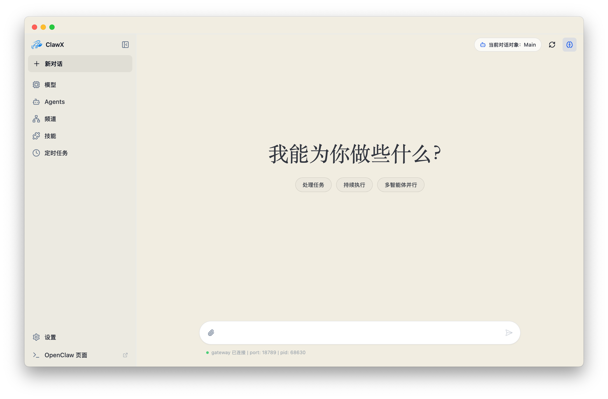
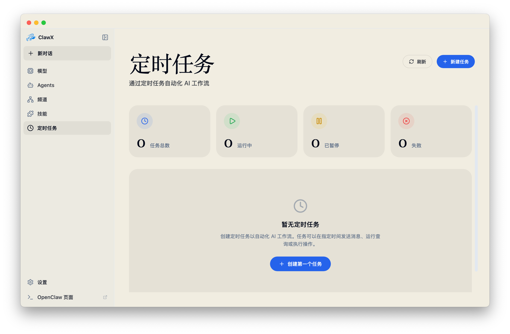
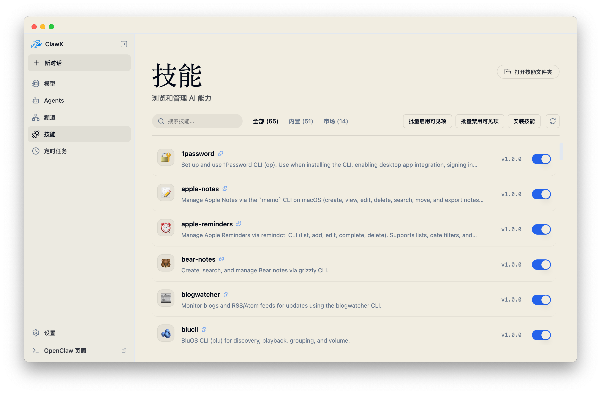
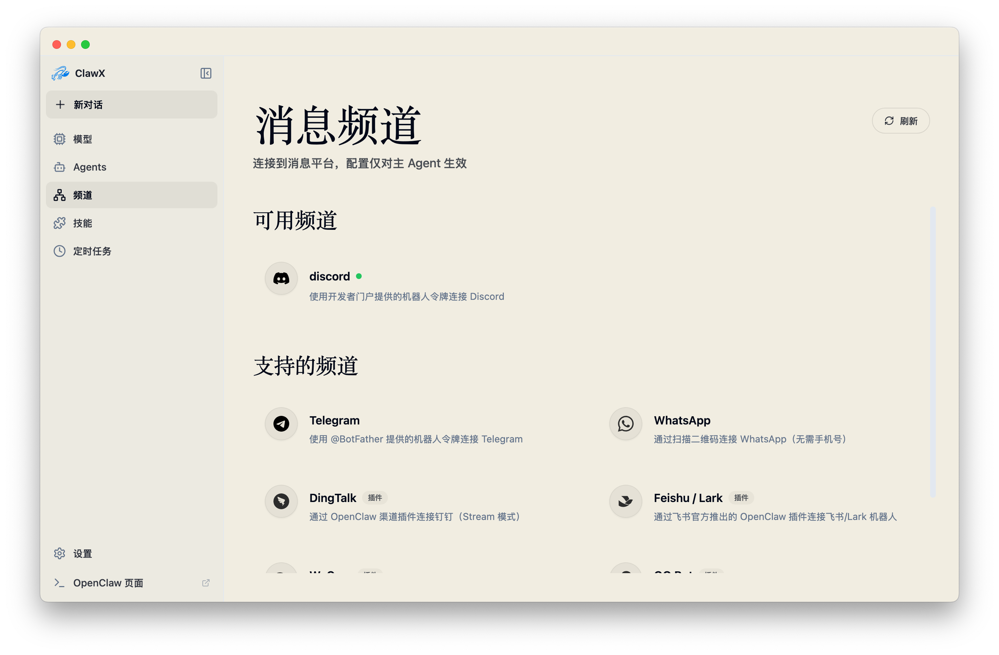

<p align="center">
  
</p>

<h1 align="center">MimiClaw</h1>

<p align="center">
  <strong>OpenClaw 的桌面任务助手，主打 Mini Chat 即时执行</strong>
</p>

<p align="center">
  <a href="#核心亮点">核心亮点</a> •
  <a href="#5-分钟上手">5 分钟上手</a> •
  <a href="#安装">安装</a> •
  <a href="#开发">开发</a> •
  <a href="#架构摘要">架构摘要</a>
</p>

<p align="center">
  
  
  
  <a href="https://discord.com/invite/84Kex3GGAh" target="_blank">
    
  </a>
  
  
</p>

<p align="center">
  <a href="https://github.com/Emma-Alpha/MimiClaw/releases"><strong>Download MimiClaw and run your first Mini Chat task</strong></a>
  <br />
  <a href="https://github.com/Emma-Alpha/MimiClaw/releases">查看发布记录</a>
</p>

---

## 一句话定位

**MimiClaw 不是聊天壳，而是把 OpenClaw 变成「一句话交代 -> 可交付结果」的桌面执行入口。**

---

## 首屏场景：Mini Chat 即时执行

<p align="center">
  
</p>

你可以在当前工作流里直接呼出 Mini Chat，把任务快速交给 AI 助手，而不是切到复杂控制台。

典型 3 步：

1. 拖入文件 / 截图 / 输入一句任务目标
2. Mini Chat 立即开始处理，支持连续追问与上下文延续
3. 得到可直接使用的结果，再决定下一步

---

## 核心亮点

### 1. Mini Chat：随时呼出，持续执行

- 从桌面悬浮入口快速打开 Mini Chat，减少页面跳转
- `Code Assistant` 可直接以持久 `CLI` 模式进入代码工作流
- 支持文件拖拽、附件处理与截图输入
- 语音输入可转写后直送 Mini Chat（需先配置火山引擎 ASR）

### 2. 任务导向：从请求到结果，而不是只聊天

- 支持多轮任务推进，保持上下文连续
- 以可验证结果为目标，便于继续迭代
- 对开发、运营、文档处理等高频工作都可直接落地

### 3. 执行能力：本地、技能、渠道、定时一体化

- 本地执行中心：目录报告、批量重命名预览、下载目录整理、命令执行
- Skills 系统：内置 `pdf` / `xlsx` / `docx` / `pptx` 等常用能力
- 多渠道管理：支持多账号、账号与 Agent 绑定、默认账号切换
- 定时任务：通过 Cron 自动化执行重复工作

---

## 5 分钟上手

### 系统要求

- 操作系统：macOS 11+、Windows 10+、Linux（Ubuntu 20.04+）
- 内存：4GB+（建议 8GB）
- 磁盘：1GB 可用空间

### 新用户最短路径

1. 从 [Releases](https://github.com/Emma-Alpha/MimiClaw/releases) 下载对应平台安装包
2. 启动 MimiClaw，完成首次向导（语言、运行环境、AI Provider）
3. 在 Mini Chat 发出第一条任务，例如：
   - 「读取这个文件并总结 5 条行动项」
   - 「按这个截图里的格式，生成一版可复制文案」
   - 「把这段需求拆成开发任务清单」

---

## 安装

### 推荐：直接下载发布版本

前往 [Releases](https://github.com/Emma-Alpha/MimiClaw/releases) 获取最新版。

### 从源码运行

```bash
git clone https://github.com/Emma-Alpha/MimiClaw.git
cd MimiClaw
pnpm run init
pnpm dev
```

`pnpm` 版本由 `packageManager` 固定，建议先执行：

```bash
corepack enable
corepack prepare
```

---

## 关键能力截图

<p align="center">
  
</p>

<p align="center">
  
</p>

<p align="center">
  
</p>

---

## 典型使用场景

- 开发提效：需求拆解、代码辅助、文档生成与整理
- 运营执行：信息汇总、日报周报草稿、流程自动化
- 内容处理：文档提炼、结构化输出、跨格式处理
- 自动化值守：定时触发任务并持续跟踪结果

---

## 开发

### 常用命令

| 任务 | 命令 |
|------|------|
| 安装依赖 + 下载 uv | `pnpm run init` |
| 本地开发 | `pnpm dev` |
| 代码检查（自动修复） | `pnpm run lint` |
| 类型检查 | `pnpm run typecheck` |
| 单测 | `pnpm test` |
| Comms 回放指标 | `pnpm run comms:replay` |
| Comms 基线刷新 | `pnpm run comms:baseline` |
| Comms 回归比较 | `pnpm run comms:compare` |
| E2E 测试 | `pnpm run test:e2e` |
| 仅构建前端 | `pnpm run build:vite` |

### 项目结构

```text
MimiClaw/
├── electron/      # Electron Main（进程管理、IPC、网关托管）
├── src/           # React Renderer（页面、状态、组件）
├── shared/        # 跨进程共享类型与协议
├── backend/       # Cloud 模式控制平面（可选）
├── resources/     # 静态资源与预置 skills
├── scripts/       # 构建、打包、回归脚本
└── tests/         # Vitest / Playwright 测试
```

### Comms 变更检查（建议）

如果修改了网关事件、消息收发、传输回退等通信链路，提交前建议执行：

```bash
pnpm run comms:replay
pnpm run comms:compare
```

---

## 架构摘要

MimiClaw 采用 Electron 双进程架构，并通过统一 Host API 连接 OpenClaw：

- Renderer 只调用 `src/lib/host-api.ts` / `src/lib/api-client.ts`
- Main 进程统一负责传输策略：`WS -> HTTP -> IPC fallback`
- OpenClaw Gateway 负责 AI runtime、渠道与技能执行

运行模式：

- 本地模式（默认）：本机启动 Gateway（端口 `18789`）
- 云模式（可选）：由 `backend/` 管理远端 Gateway 与配置

更多细节请查看：
- [backend/README.md](backend/README.md)
- [docs/superpowers/specs/2026-03-25-cloudclaw-migration-design.md](docs/superpowers/specs/2026-03-25-cloudclaw-migration-design.md)

---

## 安全与凭证

- Provider 凭证默认保存在系统原生 Keychain
- Renderer 不直接调用网关 HTTP，避免 CORS 与环境漂移问题
- 高级调试可在 **设置 -> 高级 -> 开发者** 中使用 OpenClaw Doctor

---

## 社区

| 企业微信 | 飞书群 | Discord |
| :---: | :---: | :---: |
|  |  |  |

商务合作或生态合作可联系：

- 邮箱：[1733452028@qq.com](mailto:1733452028@qq.com)

---

## 贡献

欢迎提交 Issue / PR 改进 MimiClaw。

1. Fork 仓库
2. 新建分支
3. 提交变更
4. 发起 Pull Request

---

## License

MimiClaw 基于 [MIT License](LICENSE) 开源。

<p align="center">
  <sub>Built with care by MimiClaw Team</sub>
</p>
